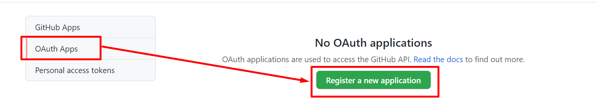

# Configuración de la seguridad

La idea es configurar la seguridad con github.

## Obtener la información de github

* Entramos en settings de github.


* Entramos en las propiedades de seguridad.


> Tambien se puede acceder desde esta URL: https://github.com/settings/developers

* Vamos a registrar una nueva aplicación



* Procedemos a registrar
  * Nombre aplicación: tools
  * Url: http://localhost:8080
  * UrlLogin: http/localhost:8080/login/oauth2/code/github


* Generamos los datos 
  * Cliente id: 9417d19498fb0fb84588
  * Token: 309b6bf33ebe918a1705fc66b2229ff656568b34


## Configurar el login en Spring

* Establecemos la dependeciam en gradle 

```kotlin
	implementation("org.springframework.boot:spring-boot-starter-oauth2-client")
```

* Configuramos el token

```yaml
spring:
  security:
    oauth2:
      client:
        registration:
         github:
          clientId: YOUR_GITHUB_APP_CLIENT_ID
          clientSecret: YOUR_GITHUB_APP_CLIENT_SECRET
          scope:
           - user:email
           - read:user
```

## Configurar url no securizadas

Para esto tenemos que activar la configuración de seguridad.

En este caso la URL, que vamos a securizar es **/core/version**

```kotlin
@SpringBootApplication
class ToolsApplication	: WebSecurityConfigurerAdapter() {
	@Throws(Exception::class)
	override fun configure(http: HttpSecurity) {
		http
			.authorizeRequests(
				Customizer { a ->
					a
						.antMatchers("/core/version").permitAll() // Las rutas publica
						.anyRequest().authenticated()  // El resto se espera autenticación.
				}
			).oauth2Login() // Establece el login
	}
}
```
> Por defecto es http.oauth2Login()

## Enlaces de interes:
* Ejemplo completo de la configuración de la seguridad: https://www.codejava.net/frameworks/spring-boot/oauth2-login-with-github-example
* Tutoria de Spring para configurarlo: https://spring.io/guides/tutorials/spring-boot-oauth2/