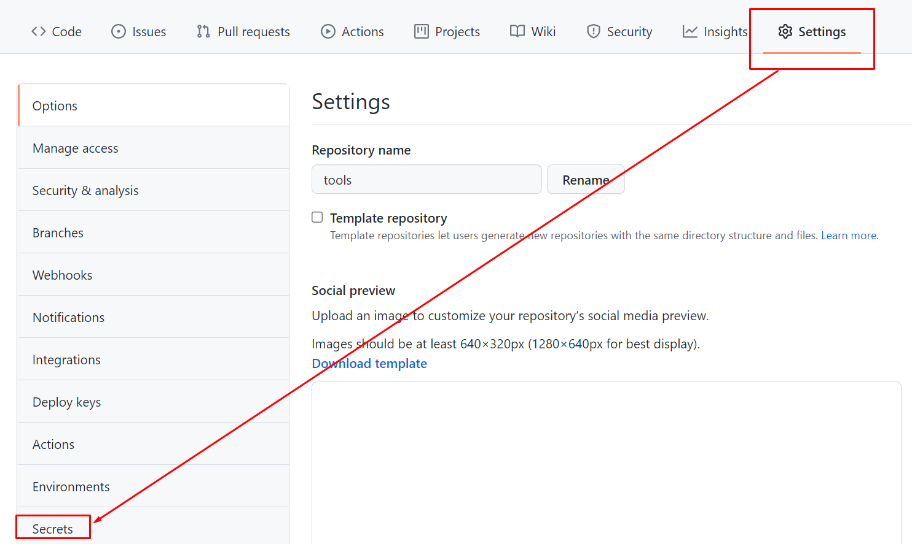
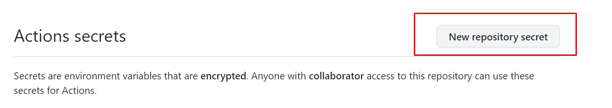
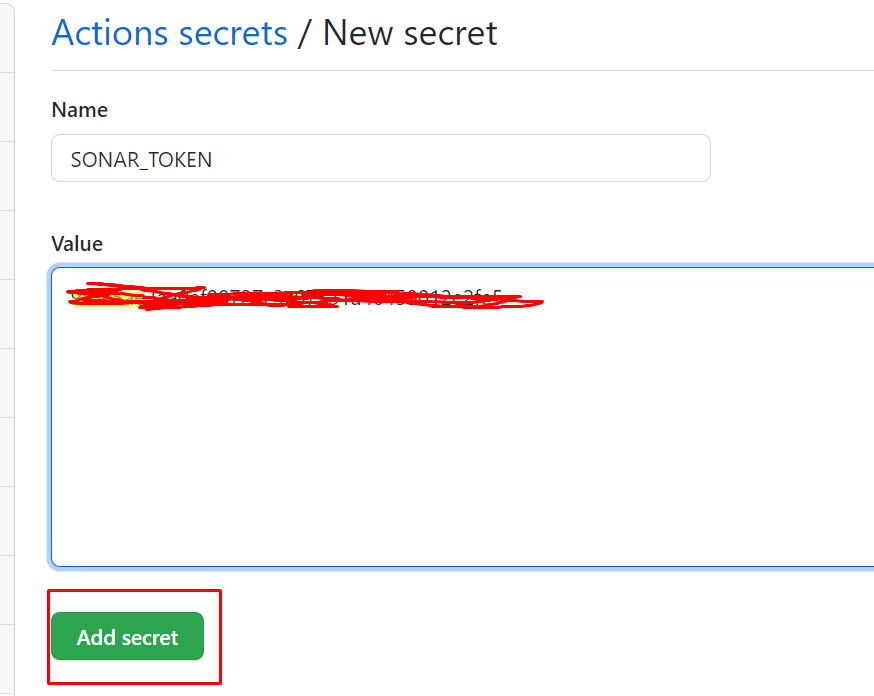
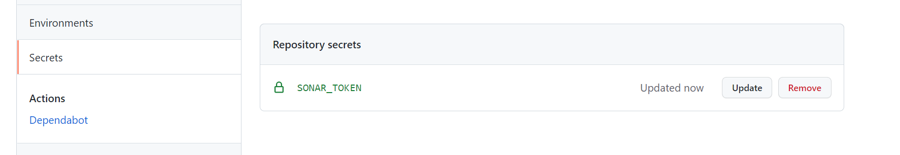

# Configurar una acción de github

En este caso la acción de github lo que va hacer es trasladar la covet

## Configurar los tokens (GITHUB).

* **SONAR_TOKEN**: Es el token que nos proporciona sonar.
* **GITHUB_TOKEN**: Es un token de github

Lo que tenemos que hacer es configurar los secretos, en este caso el de github

1. Accedemos a la opción de los secretos de nuestro repositorio



2. Creamos un nuevo secreto

* **SONAR_TOKEN** (Es el token de sonarcloud)







## Configuramos la acción de github

En este caso solo tenemos que configuramos la acción de github **.github/workflows/build.yml**


> Esta acción lo unico que hace es, llamar a gradle para que cargue los datos en sonar desde gradle.

```yaml

name: Build
on:
  push:
    branches:
      - main
  pull_request:
    types: [opened, synchronize, reopened]
  #Esto es para que se vea las ejecuciones en github  
  workflow_dispatch:
jobs:
  build:
    name: Build
    runs-on: ubuntu-latest
    steps:
      - uses: actions/checkout@v2
        with:
          fetch-depth: 0  # Shallow clones should be disabled for a better relevancy of analysis
      - name: Set up JDK 11
        uses: actions/setup-java@v1
        with:
          java-version: 11
      - name: Cache SonarCloud packages
        uses: actions/cache@v1
        with:
          path: ~/.sonar/cache
          key: ${{ runner.os }}-sonar
          restore-keys: ${{ runner.os }}-sonar
      - name: Cache Gradle packages
        uses: actions/cache@v1
        with:
          path: ~/.gradle/caches
          key: ${{ runner.os }}-gradle-${{ hashFiles('**/*.gradle') }}
          restore-keys: ${{ runner.os }}-gradle
      - name: Build and analyze
        env:
          GITHUB_TOKEN: ${{ secrets.GITHUB_TOKEN }}  # Needed to get PR information, if any
          SONAR_TOKEN: ${{ secrets.SONAR_TOKEN }}
        run: ./gradlew build sonarqube --info
```
Establecemos los permisos de gradlew, para que tenga permisos de ejecución.

```shell
git update-index --chmod=+x gradlew
```


